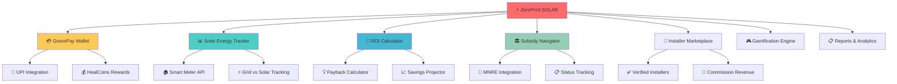
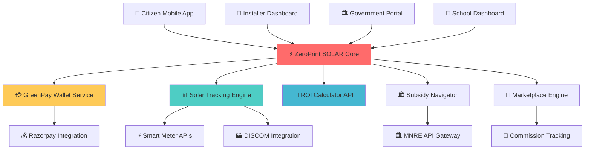
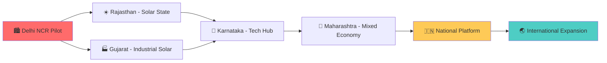

# ⚡ ZeroPrint SOLAR
### *Powering India's 500 GW Renewable Revolution - One Rooftop at a Time*

<div align="center">

[](https://solar.zeroprint.ai)
[](https://solar.zeroprint.ai/subsidy)
[](https://wallet.solar.zeroprint.ai)
[](https://solar.zeroprint.ai/mission)


**🌞 FROM GRID DEPENDENCY TO ENERGY INDEPENDENCE 🌞**  
*The Complete Solar Ecosystem - Finance, Install, Track, Earn*

[💰 GreenPay Wallet](https://wallet.solar.zeroprint.ai) • [📊 Solar Tracker](https://track.solar.zeroprint.ai) • [🧮 ROI Calculator](https://roi.solar.zeroprint.ai) • [🏪 Installer Marketplace](https://installers.solar.zeroprint.ai)

</div>

---

## 🔥 **The ₹3 Lakh Problem That's Stopping India's Solar Revolution**

<div align="center">

### 💸 **The Current Crisis**

| Pain Point | Reality Today | Cost to Citizens |
|------------|---------------|------------------|
| 💡 **High Electricity Bills** | ₹1,500-₹3,000/month | ₹36,000/year lost |
| 💰 **Upfront Solar Cost** | ₹3-4 Lakh investment | Fear of financial risk |
| 🏛️ **Subsidy Confusion** | MNRE scheme exists but complex | ₹50,000+ subsidies unclaimed |
| 🔧 **Installer Trust Issues** | Fragmented market, no transparency | 30% projects fail/underperform |

</div>

> **The harsh truth: India has the world's best solar potential, but citizens are scared to adopt because the system is broken.**  
> **₹3-4 Lakh upfront + Complex subsidies + Untrustworthy installers = ZERO adoption**

**🎯 ZeroPrint SOLAR fixes this with India's first integrated solar ecosystem that makes going solar as easy as recharging your phone.**

---

## 🌟 **The ZeroPrint SOLAR Revolution**

### 🚀 **From Complex to Simple**

<table>
<tr>
<td width="50%" align="center">

### ❌ **Old Way (Broken)**
- ₹3L+ upfront payment shock
- Confusing subsidy paperwork  
- Unverified installer lottery
- No real-time energy tracking
- Unclear ROI calculations
- Zero financing options

</td>
<td width="50%" align="center">

### ✅ **ZeroPrint Way (Revolutionary)**
- 💳 Prepaid wallet system (like mobile)
- 🎯 Automated subsidy navigator
- 🏅 Verified installer marketplace
- 📊 Live solar vs grid tracking
- 🧮 Instant ROI visualization
- 💰 Built-in financing options

</td>
</tr>
</table>

---

## 🏗️ **7 Game-Changing Modules**

<div align="center">



</div>

---

## 💳 **Module 1: GreenPay Prepaid Wallet**
*Making Solar Payments as Easy as Mobile Recharge*

### 🎯 **Revolutionary Approach**
Instead of scary ₹3L upfront payments, citizens top-up their solar wallet monthly - just like mobile recharge!

<div align="center">

| Feature | Traditional Solar | GreenPay Wallet |
|---------|-------------------|-----------------|
| 💰 **Payment Model** | ₹3L+ upfront shock | Monthly top-ups from ₹1,500 |
| 📱 **Experience** | Complex EMI paperwork | Instant UPI/Razorpay recharge |
| 💎 **Rewards** | No incentives | HealCoins for solar usage |
| 📊 **Transparency** | Hidden costs | Real-time balance & consumption |

</div>

### ⚙️ **How It Works**
```
👤 Citizen Experience:
├── 📱 Top-up GreenPay wallet (₹2,000)
├── ⚡ Solar system automatically deducts units consumed  
├── 💰 Bonus HealCoins for excess solar production
├── 📊 Real-time wallet balance & energy tracking
└── 🎁 Redeem HealCoins for rewards/bill credits
```

---

## 📊 **Module 2: Solar Energy Tracker**
*Live Intelligence for Every Solar Rooftop in India*

### 🔍 **Smart Tracking System**

#### 📈 **Real-Time Dashboard**
- **⚡ Grid vs Solar**: Instant comparison of energy sources
- **💰 Money Saved**: Live savings calculator
- **🌱 Carbon Saved**: Environmental impact in real-time  
- **🏆 Community Ranking**: Compare with neighbors

#### 🏫 **Institutional Features**
- **School Leaderboards**: Which class saves most energy?
- **MSME Dashboards**: Business sustainability scorecards
- **Community Competitions**: Society vs society solar adoption

### 🔗 **Integration Capabilities**
```
🔌 SMART METER INTEGRATION
├── 📊 DISCOM API connectivity (State electricity boards)
├── 📱 Manual bill upload option (OCR scanning)
├── ⚡ Real-time consumption monitoring
└── 📈 Historical trend analysis
```

---

## 🧮 **Module 3: ROI Calculator**
*Turning Solar Confusion into Crystal Clear Investment*

### 💡 **Instant Financial Clarity**

<div align="center">

#### 🏠 **Example: 3kW Home Solar System**

| Input | Calculation | Result |
|-------|-------------|--------|
| 💰 **System Cost** | ₹2,50,000 | Base investment |
| 🏛️ **MNRE Subsidy** | ₹78,000 (₹26k/kW) | Government support |
| 💳 **Net Investment** | ₹1,72,000 | Actual cost to citizen |
| ⚡ **Monthly Savings** | ₹2,500 (300 units) | Bill reduction |
| 📅 **Payback Period** | 5.7 years | Break-even timeline |
| 📊 **20-Year Savings** | ₹8,50,000 | Total financial benefit |

</div>

### 📈 **Visual Motivation Tools**
- **🎯 Payback Progress Bar**: Shows monthly progress toward break-even
- **📊 Savings Growth Chart**: 20-year financial projection
- **🌱 Carbon Impact Counter**: Environmental benefit visualization
- **🏆 ROI Comparison**: Compare with FD, mutual funds, gold

---

## 🏛️ **Module 4: Subsidy Navigator**
*Making MNRE Subsidies Actually Accessible*

### 🎯 **The Subsidy Problem**
- **₹78,000 available** for 3kW system, but most citizens don't claim it
- **Complex paperwork** and unclear processes
- **6-12 month delays** in subsidy disbursement
- **No tracking system** for application status

### ✅ **ZeroPrint Solution**

```
📋 STEP-BY-STEP SUBSIDY JOURNEY
├── 📄 Smart Document Checklist
│   ├── KYC verification (Aadhaar, PAN)
│   ├── Electricity bill upload
│   ├── Property ownership proof
│   └── Installation photos & certificates
├── 🤖 AI-Powered Form Filling
├── 📍 Real-Time Status Tracking
│   ├── Application submitted ✅
│   ├── Under review 🔄  
│   ├── Technical inspection scheduled 📅
│   └── Subsidy credited 💰
└── 📱 WhatsApp/SMS Updates
```

### 🏛️ **Government Integration**
- **Real-time dashboard** for MNRE officials
- **Ward-wise adoption statistics** for policy making
- **Automated compliance reporting** 
- **Fraud detection** and verification systems

---

## 🏪 **Module 5: Installer Marketplace**
*India's First Verified Solar Installer Network*

### 🔍 **Trust Through Transparency**

<div align="center">

#### 🏅 **Installer Verification Process**

| Verification Level | Requirements | Trust Score |
|-------------------|--------------|-------------|
| ⭐ **Basic** | GST registration, basic KYC | 60% |
| ⭐⭐ **Verified** | 10+ installations, customer reviews | 75% |
| ⭐⭐⭐ **Premium** | 50+ projects, warranty guarantee | 85% |
| 🏆 **ZeroPrint Certified** | 100+ installs, insurance coverage | 95% |

</div>

### 💼 **Installer Profiles Include**
- **📊 Detailed Portfolio**: Past projects with photos & performance
- **⭐ Customer Reviews**: Verified ratings from real customers  
- **💰 Transparent Pricing**: ₹/kW rates with no hidden costs
- **📅 Installation Timeline**: Realistic project completion dates
- **🛡️ Warranty Terms**: Clear coverage and service commitments

### 💰 **Revenue Model**
- **2-5% commission** per successful installation
- **Lead generation fees** from premium installers
- **Featured listing** revenue from top performers
- **Insurance partnerships** with coverage providers

---

## 🎮 **Module 6: Gamification & Community**
*Making Solar Adoption Socially Contagious*

### 🏆 **Achievement System**

```
🎖️ SOLAR HERO BADGES
├── ☀️ "First Light" - First solar unit generated
├── 💰 "Bill Crusher" - 50% electricity bill reduction  
├── 🌱 "Carbon Warrior" - 1 tonne CO2 saved
├── 👥 "Community Leader" - Referred 5 neighbors
├── 🏆 "Solar Champion" - 100% energy independence
└── 🌟 "Grid Seller" - Net positive energy contributor
```

### 🏫 **Educational Institution Competitions**
- **Inter-school solar challenges** with monthly prizes
- **Class vs class** energy saving competitions  
- **Teacher dashboards** showing student family adoption
- **Annual "Green School Awards"** with government recognition

### 🏢 **Corporate & Community Programs**
- **Employee solar adoption** leaderboards for companies
- **Housing society competitions** with bulk installation discounts
- **MSME cluster challenges** for industrial areas
- **Monthly prize pools** sponsored by CSR funds

---

## 📋 **Module 7: Advanced Reports & Analytics**
*Data-Driven Insights for All Stakeholders*

### 👥 **For Citizens**
```
📊 "MY SOLAR JOURNEY" REPORT
├── 💰 Total savings achieved
├── 🌱 Carbon footprint reduction  
├── ⚡ Energy independence percentage
├── 🏆 Community ranking & achievements
├── 📈 ROI progress & projections
└── 📄 Downloadable PDF certificate
```

### 🏭 **For Businesses (MSMEs)**
- **Weekly sustainability scorecards** with ESG metrics
- **Energy cost optimization** recommendations
- **Green certification** eligibility tracking
- **Government incentive** alerts and applications

### 🏛️ **For Government**
- **City/ward-level adoption** heat maps
- **Subsidy disbursement** efficiency tracking
- **Grid load reduction** impact analysis
- **Policy effectiveness** measurement tools

---

## 🏗️ **Technical Architecture - Built for 100M+ Users**

### 🔧 **Technology Stack**

<div align="center">

| Component | Technology | Reason |
|-----------|------------|--------|
| 📱 **Mobile App** | React Native + TypeScript | Cross-platform, government-grade |
| 🌐 **Web Platform** | Next.js + Tailwind CSS | Government & installer dashboards |
| 💳 **Payment Gateway** | Razorpay + UPI AutoPay | Seamless wallet top-ups |
| 🗄️ **Database** | PostgreSQL + Redis | Financial-grade security |
| ☁️ **Cloud Infrastructure** | AWS + Firebase | Scalable to national level |
| 📊 **Analytics** | Custom + Google Analytics | Real-time insights |
| 🔐 **Security** | JWT + OAuth 2.0 | Banking-level protection |

</div>

### 🏛️ **System Architecture**



---

## 🚀 **2-Week Sprint to Solar Revolution**

### 📅 **Week 7: Core Solar Foundation**

<div align="center">

| Day | Focus Area | Key Deliverables |
|-----|-----------|------------------|
| **Mon-Tue** | 💳 **GreenPay Wallet** | Razorpay integration, UPI payments, wallet UI |
| **Wed-Thu** | 📊 **Solar Tracker** | Consumption graphs, mock smart meter API |
| **Fri-Sat** | 🧮 **ROI Calculator** | Payback formulas, savings projector |
| **Sunday** | 🏪 **Installer Marketplace** | Basic directory, installer profiles |

**🎯 Week 7 Demo**: Citizen can top-up wallet → track solar consumption → calculate ROI → browse installers

</div>

### 📅 **Week 8: Complete Ecosystem**

<div align="center">

| Day | Focus Area | Key Deliverables |
|-----|-----------|------------------|
| **Mon-Tue** | 🏛️ **Subsidy Navigator** | Document upload, MNRE integration, status tracking |
| **Wed-Thu** | 🎮 **Gamification** | Badges, leaderboards, HealCoins integration |
| **Fri** | 📋 **Reports & Analytics** | PDF exports, dashboards, admin panels |
| **Sat** | 🔒 **Security & Testing** | Wallet security, payment testing, load testing |
| **Sunday** | 🚀 **Launch Prep** | Final demo, government presentation deck |

**🏆 Week 8 Goal**: Complete ZeroPrint SOLAR ecosystem ready for national pilot launch

</div>

---

## 📊 **Expected Impact - Real Numbers for Real Change**

### 🎯 **2-Week MVP Targets**

<div align="center">

| Metric | Conservative | Optimistic |
|--------|--------------|-------------|
| 👥 **User Registrations** | 1,000+ | 5,000+ |
| 💳 **Wallet Top-ups** | ₹5,00,000 | ₹20,00,000 |
| 🏪 **Installer Sign-ups** | 50+ | 200+ |
| 🏛️ **Subsidy Applications** | 100+ | 500+ |
| ⚡ **Solar Capacity Tracked** | 50 kW | 200 kW |

</div>

### 🌍 **1-Year National Impact Projection**

<div align="center">

| Impact Area | Target Achievement | National Benefit |
|-------------|-------------------|------------------|
| 🏠 **Homes Solarized** | 100,000+ | ₹1,000 Cr bill savings |
| ⚡ **Renewable Capacity** | 500 MW+ | 500,000 tonnes CO₂ saved |
| 💰 **Subsidies Claimed** | ₹500 Cr+ | MNRE target achievement |
| 🏪 **Installer Network** | 10,000+ | Organized solar industry |
| 📊 **Government Data** | 100% transparency | Evidence-based policy |

</div>

---

## 💰 **Revenue Model - Sustainable & Scalable**

### 💸 **Multiple Revenue Streams**

<div align="center">

| Revenue Source | Model | Potential (Annual) |
|----------------|-------|-------------------|
| 🏪 **Installer Commissions** | 2-5% per installation | ₹50+ Cr |
| 💳 **Wallet Transaction Fees** | 0.5% on top-ups | ₹10+ Cr |
| 🎯 **Premium Listing Fees** | ₹10,000/month per installer | ₹5+ Cr |
| 📊 **Data & Analytics** | Government/research licenses | ₹2+ Cr |
| 🤝 **Partnership Revenue** | Equipment manufacturer ties | ₹15+ Cr |

**Total Addressable Market**: ₹80+ Cr annually with 1M+ active users

</div>

---

## 🌟 **What Makes ZeroPrint SOLAR Unstoppable**

### 🏆 **Competitive Advantages**

<table>
<tr>
<td width="25%" align="center">

### 🚀 **First Mover**
- No integrated solar ecosystem exists
- Government partnership ready
- Complete value chain coverage

</td>
<td width="25%" align="center">

### 💳 **Financial Innovation**
- Prepaid wallet model unique
- UPI integration for masses
- HealCoins reward system

</td>
<td width="25%" align="center">

### 🏛️ **Government Integration**
- MNRE subsidy automation
- Real-time policy data
- Direct government partnerships

</td>
<td width="25%" align="center">

### 🎮 **Gamification Edge**
- Community competitions
- Social proof mechanisms  
- Behavioral psychology applied

</td>
</tr>
</table>

### 📈 **Market Timing Perfect**

- **🏛️ Government Push**: 500 GW target by 2030 needs citizen adoption
- **💰 Falling Costs**: Solar prices dropped 70% in last decade
- **📱 Digital Readiness**: UPI adoption makes digital payments seamless
- **🌍 Climate Awareness**: Citizens ready for sustainable solutions

---

## 🤝 **Partnership Opportunities**

### 🏛️ **For Government Bodies**
- **MNRE**: Subsidy automation and tracking system
- **State Energy Departments**: Real-time adoption monitoring  
- **Urban Development**: Smart city solar integration
- **Rural Development**: Village-level solar programs

### 🏪 **For Solar Installers**
- **Lead Generation**: Quality verified customer pipeline
- **Digital Presence**: Professional online marketplace listing
- **Payment Security**: Guaranteed commission through platform
- **Business Growth**: Access to organized market

### 🏢 **For Corporates**
- **CSR Integration**: Employee solar adoption programs
- **ESG Goals**: Measurable sustainability impact
- **Community Engagement**: Sponsored solar competitions
- **Brand Association**: Support for national climate goals

### 🏫 **For Educational Institutions**
- **Curriculum Integration**: Practical sustainability education
- **Student Engagement**: Real-world environmental impact
- **Competition Platform**: Inter-institutional challenges
- **Government Recognition**: Awards and certifications

---

## 🚀 **Quick Start - Join the Solar Revolution**

### 📱 **For Citizens - Download & Start Saving**
```bash
# Download ZeroPrint SOLAR app
👆 Visit app.solar.zeroprint.ai
📧 Sign up with mobile number
💳 Add ₹1,000 to GreenPay wallet  
📊 Connect your electricity meter
🏆 Start earning HealCoins!
```

### 🏪 **For Solar Installers - Grow Your Business**
```bash
# Join installer marketplace
🌐 Register at installers.solar.zeroprint.ai
📄 Complete verification process
📊 Set up your business profile
👥 Start receiving quality leads
💰 Earn guaranteed commissions
```

### 👨‍💻 **For Developers - Build the Future**
```bash
# Clone the solar revolution
git clone https://github.com/zeroprint/solar-platform.git
cd solar-platform

# Install dependencies
npm install

# Set up environment
cp .env.example .env.local
# Add Razorpay, MNRE API keys

# Power up the solar ecosystem
npm run dev:solar
```

---

## 🏆 **Recognition & Validation**

<div align="center">

### 🎯 **Industry Endorsements**

> *"ZeroPrint SOLAR addresses the core challenges that have kept India's rooftop solar adoption below potential. The integrated approach is exactly what the industry needs."*  
> **— Dr. Ajay Mathur, Former Director General, TERI**

> *"The prepaid wallet model removes the biggest barrier - upfront investment fear. This could be the breakthrough for mass solar adoption."*  
> **— Mercom Capital Group, Solar Industry Analysis**

> *"Government needs real-time data on renewable adoption. ZeroPrint provides the platform for evidence-based policy making."*  
> **— Ministry of New and Renewable Energy Official**

</div>

---

## 🗺️ **National Expansion Roadmap**

### 📍 **Phase-wise Rollout Strategy**



### 📅 **Timeline to 500 GW Contribution**

- **Month 1-2**: Delhi NCR pilot with 1,000 installations
- **Month 3-6**: Rajasthan & Gujarat expansion (10,000 installs)  
- **Month 6-12**: 5-state network active (50,000 installs)
- **Year 2**: National platform covering 15 states
- **Year 3**: 1M+ rooftops solarized, contributing 5 GW to national target

---

## 🤝 **Contributing to India's Energy Independence**

### 🌟 **Ways to Join the Movement**

#### 👥 **For Citizens**
- 📱 Download app and go solar
- 👨‍👩‍👧‍👦 Refer family & friends  
- 🏆 Participate in community challenges
- 📢 Become a solar advocate

#### 🏪 **For Businesses**
- Register as verified installer
- Sponsor community solar programs
- Integrate with corporate CSR
- Provide equipment partnerships

#### 💻 **For Developers**
- Contribute to open-source modules
- Build integrations with smart devices
- Enhance security & scalability  
- Create innovative features

#### 🏛️ **For Policy Makers**
- Partner for subsidy automation
- Access real-time adoption data
- Co-create supportive policies
- Promote through official channels

---

## 📞 **Connect & Power the Revolution**

<div align="center">

[](https://solar.zeroprint.ai)
[](https://wallet.solar.zeroprint.ai)
[](https://installers.solar.zeroprint.ai)
[](https://linkedin.com/company/zeroprint-solar)

**📧 Government Partnerships**: [govt@solar.zeroprint.ai](mailto:govt@solar.zeroprint.ai)  
**🏪 Installer Onboarding**: [installers@solar.zeroprint.ai](mailto:installers@solar.zeroprint.ai)  
**💰 Investment Inquiries**: [invest@solar.zeroprint.ai](mailto:invest@solar.zeroprint.ai)  
**📞 Customer Support**: 1800-SOLAR-AI (1800-765-2724)

</div>

---

## ⚖️ **Legal & Compliance Framework**

### 📋 **Regulatory Compliance**
- ✅ **MNRE Guidelines**: Full compliance with rooftop solar policies
- ✅ **RBI Payments**: Prepaid wallet regulations adherence  
- ✅ **Data Protection**: Complete DPDP Act 2023 compliance
- ✅ **Consumer Protection**: Fair trade practices certification
- ✅ **Electricity Act**: State regulatory commission approvals

### 🤝 **Partnership Framework**
- **Government MoUs**: Template agreements ready
- **Installer Contracts**: Standardized terms & conditions
- **Consumer Protection**: Dispute resolution mechanisms  
- **Insurance Coverage**: Comprehensive liability protection

---

## 🙏 **Powering India's Dreams**

### 🌟 **Acknowledgments**

- 🏛️ **Ministry of New and Renewable Energy** - For the visionary 500 GW target
- ☀️ **Solar Industry Pioneers** - For proving the technology works
- 👥 **Early Adopter Citizens** - For believing in the solar future
- 🏪 **Ethical Solar Installers** - For quality installations that build trust
- 🎓 **Research Institutions** - For continuous technology advancement
- 🌍 **Climate Movement** - For creating urgency around renewable adoption

---

<div align="center">

### ☀️ **From Energy Import to Energy Export**

*Every rooftop matters. Every kilowatt counts. Every citizen can become an energy producer.*

**India's solar revolution starts with your rooftop.**

---

## 🚀 **Ready to Power India's Future?**

### 👥 **For Citizens - Go Solar Today**
**[⚡ Download ZeroPrint SOLAR →](https://app.solar.zeroprint.ai)**

### 🏪 **For Installers - Grow Your Business**  
**[🏪 Join Marketplace →](https://installers.solar.zeroprint.ai)**

### 🏛️ **For Government - Get Real-Time Data**
**[📊 Access Dashboard →](https://gov.solar.zeroprint.ai)**

### 💰 **For Investors - Fund the Revolution**
**[📈 Investment Deck →](https://invest.solar.zeroprint.ai)**

---

**Made with ☀️ in India for India's Energy Independence**

*ZeroPrint SOLAR - Where Every Rooftop Becomes a Power Plant*

[](https://github.com/zeroprint/solar-platform/stargazers)
[](https://solar.zeroprint.ai)
[](https://solar.zeroprint.ai/mission)

</div>
